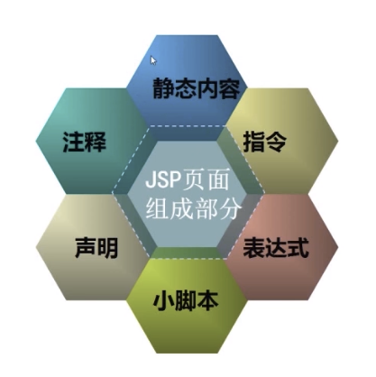
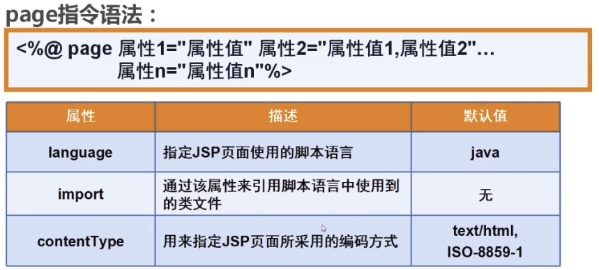
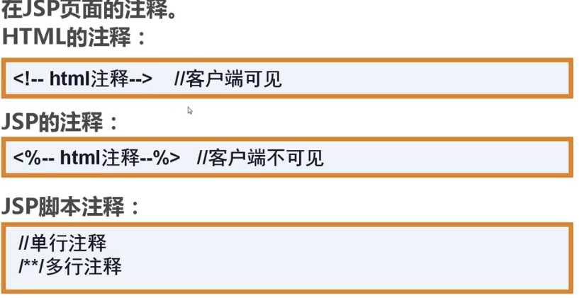
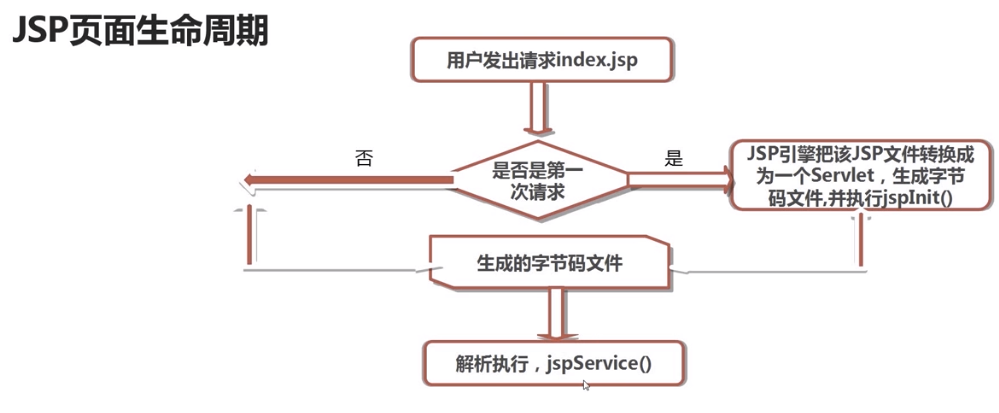
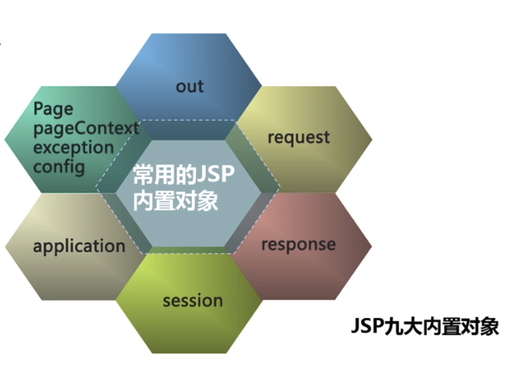
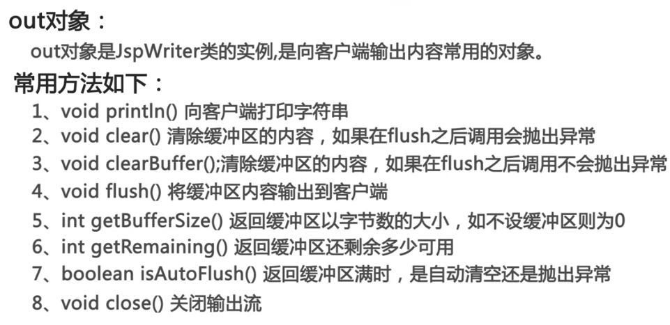

## JSP介绍
JSP全称Java Server Pages,其本质是一种简化Servlet的设计，它实现了在Java中使用HTML标签，JSP是一种动态网页技术标准，也只JavaEE的标准，JSP和Servlet一样，在服务端执行。

## 常见动态网站开发技术对比
- Jsp：Java平台，安全性高，适合开发大型的，企业级的Web应用程序
- Asp.net：.net平台，简单易学，但安全性与跨平台性差
- Php：简单，高效，成本低，开发周期短，特别适合中小型企业(LAMP:Linux+Apache+Mysql+PHP)

## Jsp页面元素构成

### 指令
- page指令：

### Jsp注释

### Jsp脚本

        <%Java代码%>
### Jsp声明

        <%! 声明变量，方法，类 %>
### Jsp表达式

        <%= 表示式(不以；结尾) %>
## Jsp页面的生命周期

## 九大内置对象

### out对象

## 中文乱码问题
- post表单中文乱码：request.setCharacterEncoding("utf-8");
- url中的中文参数乱码：在server.xml中的Connector中添加URIEncoding="utf-8"

## 请求转发跟请求重定向的区别
- 请求重定向：客户端行为，response.sendRedirect(),从本质上讲等同于两次请求，前一次的请求对象不会保存，地址了的URL会变
- 请求转发：服务器行为，request.getRequestDispatcher().forward(req,resp),一次请求，转发后会保存，地址栏的URL不会变

