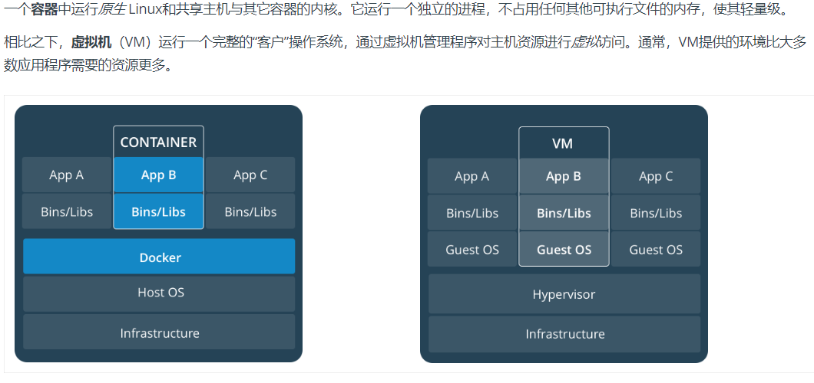

# 什么是Docker

    Docker是开发人员和系统管理员使用容器开发、部署、运行应用程序的平台，使用linux容器部署应用称为容器化

# Docker的优点

    灵活：复杂的应用集装箱化
    轻量：共享主机内核
    可互换：即时部署更新和升级
    便携式：本地构建,部署到云
    可扩展：分发容器副本
    可堆叠：垂直即时堆叠服务

# 容器和虚拟机的区别

# Ubuntu安装Docker

    1. sudo apt install docker.io
    2. systemctl docker start
    3. systemctl enable docker

## 更改镜像源

    1.sudo vim /etc/docker/daemon.json
    2.添加配置信息
    {
      "registry-mirrors":  
      ["https://docker.mirrors.ustc.edu.cn"]
    } 
    阿里云加速源
    sudo mkdir -p /etc/docker
    sudo tee /etc/docker/daemon.json <<-'EOF'
    {
    "registry-mirrors": ["https://gle3e6xb.mirror.aliyuncs.com"]
    }
    EOF
    sudo systemctl daemon-reload
    sudo systemctl restart docker
## 常用命令

    1.拉取镜像
    docker pull mysql:5.6
    2.查看镜像
    docker images
    3.运行镜像(会得到一个容器)
    docker run -itd -P mysql:5.6 bash
    docker run -itd -p 指定ip:port:port name  ...
    4.查看容器
    docker ps -a
    5.启动/关闭容器
    docker start/stop 容器id
    6.在运行的容器中执行命令
    docker exec -it 容器name bash
    7.删除容器
    docker rm name/id
    8.查找镜像
    docker search 镜像名
    9.设置镜像tag
    docker tag id name:tag信息
    10.查看端口绑定情况
    docker port name port
    11.特权模式下启动centos
    docker run -it --name centos7 --privileged=true centos:latest /usr/sbin/init

# 解决Docker时间与系统时间不同步

    CentOS
    echo "Asia/shanghai" > /etc/timezone;
    Ubuntu：
    cp /usr/share/zoneinfo/Asia/Shanghai /etc/localtime
    
