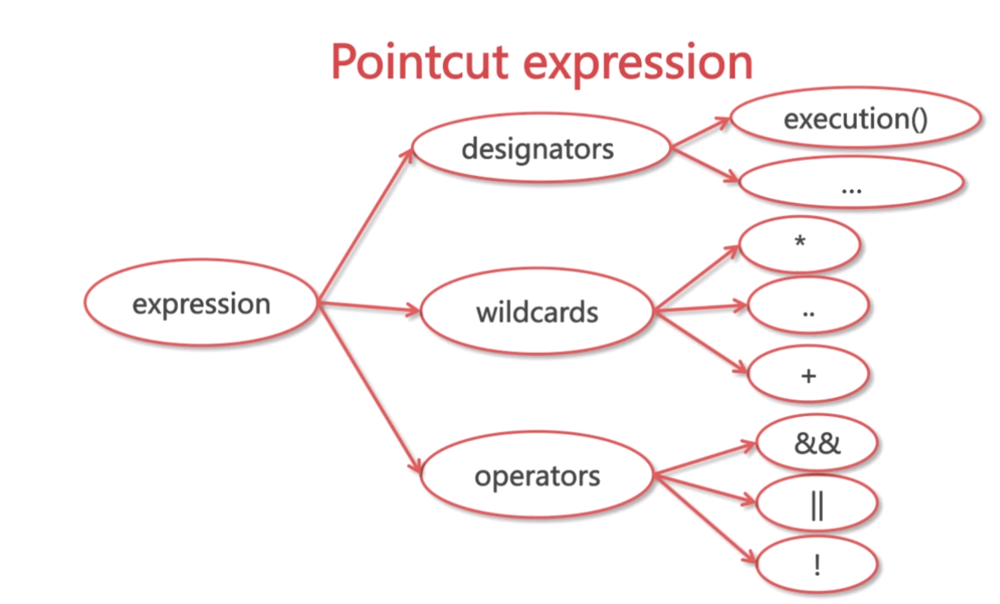
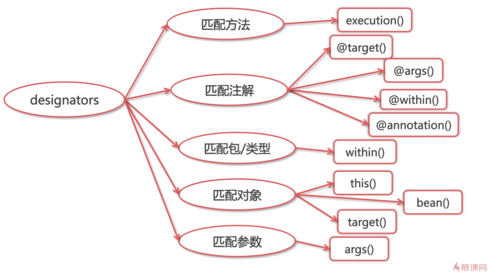
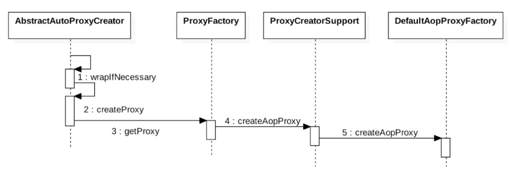

# 面向切面编程

    面向切面编程是一种编程范式，一种编程思想。
    面向切面编程的初衷：
    关注点分离，减少重复代码
    优点:
    1.集中处理某一关注点
    2.可以方便的添加关注点
    3.侵入性少，增加代码可读性、可维护性
    应用场景：
    权限控制，缓存控制，事务控制，审计日志，性能监控，分布式跟踪，异常处理

# Spring切入点表达式

## wildcards(通配符)
    * 匹配任意数量的字符
    .. 任意数量的子包或参数
    + 匹配指定类及其子类

## designators

## 格式

    Pointcut("execution(public void(函数返回类型) com.imooc.service..*Service.*(..))")
  
## 五种advice

    Before:前置通知
    After:后置通知
    AfterReturning:返回通知
    AfterThrowing:异常通知
    Around:环绕通知

# SpringAOP原理
## 概述

    代理织入的时机：
    1.编译期(AspectJ)
    2.类加载时(AspectJ 5+)
    3.运行时(Spring AOP)

## 动态代理与静态代理

    静态代理：接口中每增加一个方法，代理类中就要新增该方法的实现。
    动态代理：接口中新增方法，代理类不需要变化。
    1.jdk动态代理：代理类实现InvocationHandler接口，需要通过构造函数将被代理类传入
    2.cglib动态代理：代理类实现MethodInterceptor接口

    jdk动态代理与cglib动态代理的区别：
    1.jdk代理只针对有接口的类的接口方法进行动态代理
    2。cglib通过继承来实现的代理，所以无法对static、final类进行代理，无法对private、static方法进行代理

# Spring动态代理

# Spring AOP的应用

    @Transaction:事务控制
    @PreAuthorize:权限控制
    @Cacheable:缓存管理