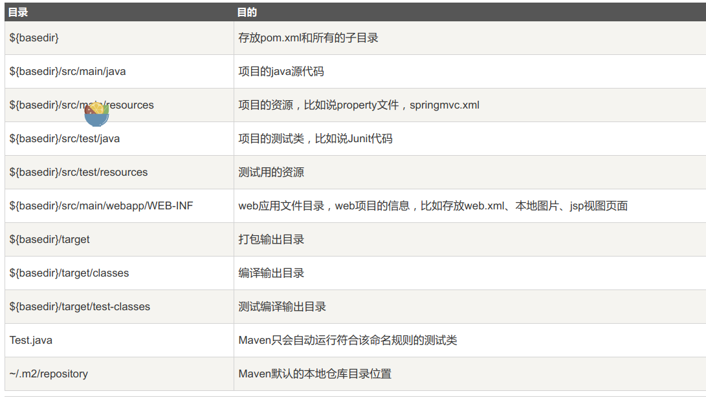
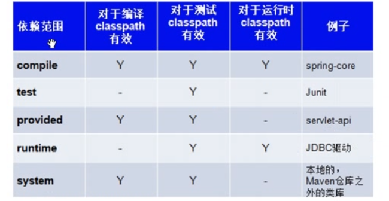

# 什么是Maven

    Maven是Apache下的一个纯Java开发的开源项目，是项目构建工具，用来管理依赖。基于项目对象模型(POM)概念，
# Maven的功能
- 构建
- 文档生成
- 报告
- 依赖
- SCM
- 发布
- 分发
- 邮件列表

# 约定配置

# Maven POM

    <project xmlns = "http://maven.apache.org/POM/4.0.0"
    xmlns:xsi = "http://www.w3.org/2001/XMLSchema-instance"
    xsi:schemaLocation = "http://maven.apache.org/POM/4.0.0
    http://maven.apache.org/xsd/maven-4.0.0.xsd">
 
    <!-- 模型版本 -->
    <modelVersion>4.0.0</modelVersion>
    <!-- 公司或者组织的唯一标志，并且配置时生成的路径也是由此生成， 如com.companyname.project-group，maven会将该项目打成的jar包放本地路径：/com/companyname/project-group -->
    <groupId>com.companyname.project-group</groupId>
 
    <!-- 项目的唯一ID，一个groupId下面可能多个项目，就是靠artifactId来区分的 -->
    <artifactId>project</artifactId>
 
    <!-- 版本号 -->
    <version>1.0</version>
    </project>
    所有POM文件都需要project元素，三个必要属性：groupId,artifactiId,version

# Maven构建周期

    begin->validate->compile->test->package->verify->install->deploy

# Maven常用命令

    mvn clean:清理target目录
    mvn compile:编译Java文件，生成target目录
    mvn test:执行单元测试，会先执行编译操作，单元测试名字×××Test.java
    mvn package:会事先执行compile，test
    mvn install:打包到本地仓库，解决本地仓库公用一个jar包
# Maven生命周期

    三套生命周期：
    cleanLifeCircle,defaultLifeCircle,siteLifeCircle

# Maven的依赖管理
默认是compile

# 利用Maven创建一个简单的web应用

    mvn archetype:generate -DgroupId=com.companyname.automobile -DartifactId=trucks -DarchetypeArtifactId=maven-archetype-webapp  -DinteractiveMode=false

# Maven自动化部署

    <scm>
        <url>http://www.svn.com</url>
        <connection>scm:svn:http://localhost:8080/svn/jrepo/trunk/
      Framework</connection>
        <developerConnection>scm:svn:${username}/${password}@localhost:8080:
      common_core_api:1101:code</developerConnection>
    </scm>
    <distributionManagement>
        <repository>
            <id>Core-API-Java-Release</id>
            <name>Release repository</name>
            <url>http://localhost:8081/nexus/content/repositories/
            Core-Api-Release</url>
        </repository>
    </distributionManagement>
    <build>
        <plugins>
            <plugin>
                <groupId>org.apache.maven.plugins</groupId>
                <artifactId>maven-release-plugin</artifactId>
                <version>2.0-beta-9</version>
                <configuration>
                <useReleaseProfile>false</useReleaseProfile>
                <goals>deploy</goals>
                <scmCommentPrefix>[bus-core-api-release-checkin]-<
                /scmCommentPrefix>
                </configuration>
            </plugin>
        </plugins>
    </build>
    SCM	        配置SVN 的路径，Maven 将从该路径下将代码取下来。
    repository	构建的 WAR 或 EAR 或JAR 文件的位置，或者其他源码构建成功后生成的构件的存储位置。
    Plugin	    配置 maven-release-plugin 插件来实现自动部署过程。