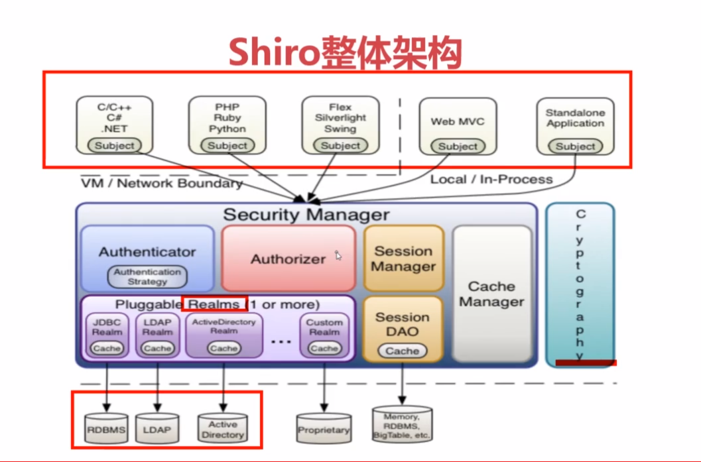
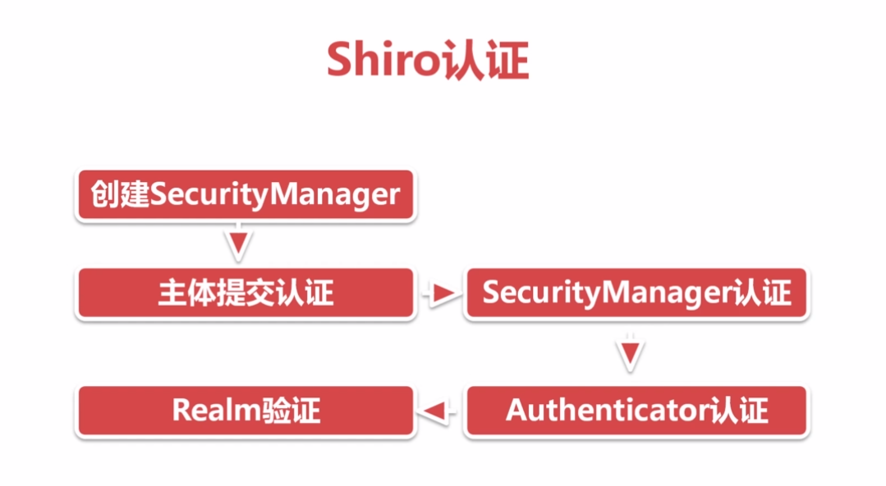
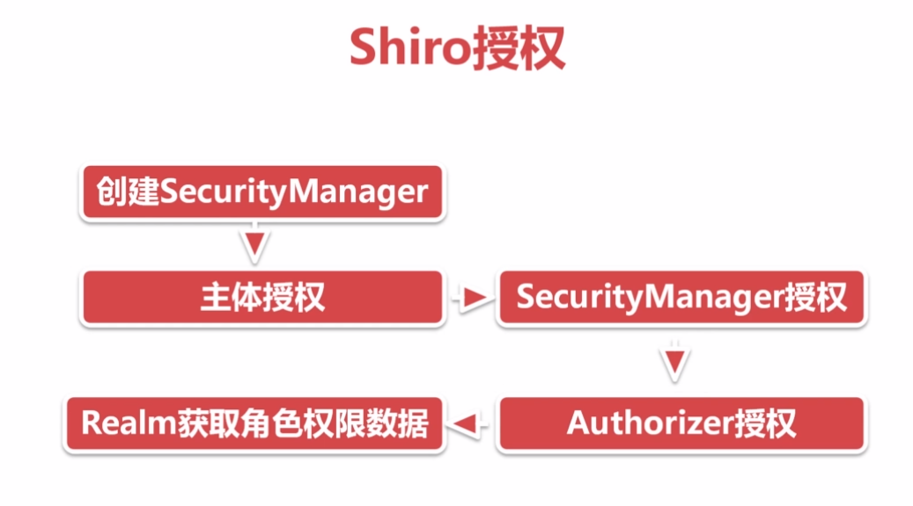

# 概述

    shiro是Apache开源的一个强大灵活的安全框架
    提供认证、授权、企业会话管理、安全加密等功能

# Shiro架构图

# Shiro认证流程

    //1.构建SecurityManager环境
    DefaultSecurityManager dsm = new DefaultSecurityManager();
    SimpleAccountRealm sar = new SimpleAccountRealm();
    sar.addAcount("username","password");
    dsm.setReaml(sar);

    //2.主体提交请求
    SecurityUtils.setSecurityMananger(dsm);
    Subject subject = SecurityUtils.getSubjetc();
    UsernamePasswordToken token = new UsernamePasswordToker("username","password");
    subject.login(token);

# Shiro授权流程

# 三种Realm介绍

    1.IniRealm：通过配置.ini文件实现用户登陆的认证，角色和权限认证
    2.JdbcRealm：通过自定义查询语句从数据库中获取认证信息，角色和权限信息
    3.自定义Realm实现AuthorizingRealm：

# Shiro内置过滤器

    anon,authBasic,authc,user,logout
    perms,roles,ssl.port
# 开启Shiro注解

        <!-- 开启Shiro注解-->
        <aop:config proxy-target-class="true"/>
        <bean class="org.apache.shiro.spring.LifecycleBeanPostProcessor"/>
        <bean class="org.apache.shiro.spring.security.interceptor.AuthorizationAttributeSourceAdvisor">
                <property name="securityManager" ref="securityManager"/>
        </bean>
## Shiro自定义过滤器

    1.继承AuthenticAuthorizationFilter类
    2.在Spring配置文件中配置bean
    3.声明Filter
    4.使用Filter
    <bean id="shiroFilter" class="org.apache.shiro.spring.web.ShiroFilterFactoryBean">
        <property name="securityManager" ref="securityManager"/>
        <property name="loginUrl" value="login.html"/>
        <property name="unauthorizedUrl" value="403.html"/>
        <property name="filterChainDefinitions">
            <value>
                /login.html = anon
                /subLogin = anon

                <!--使用自定义Filter-->
                /testRole1 = rolesOr["admin","admin1"]

                /* = authc
            </value>
        </property>
        <property name="filters">
            <util:map>
                <!--声明Filter-->
                <entry key="rolesOr" value-ref="rolesOrFilter"/>
            </util:map>
        </property>
    </bean>
    <!-- 自定义shiro权限过滤-->
    <bean class="com.imooc.filter.RolesOrFilter" id="rolesOrFilter"/>

# Shiro会话管理
