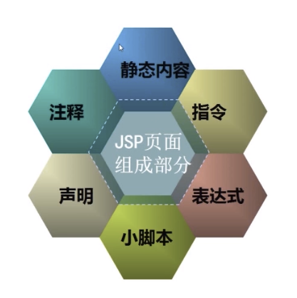
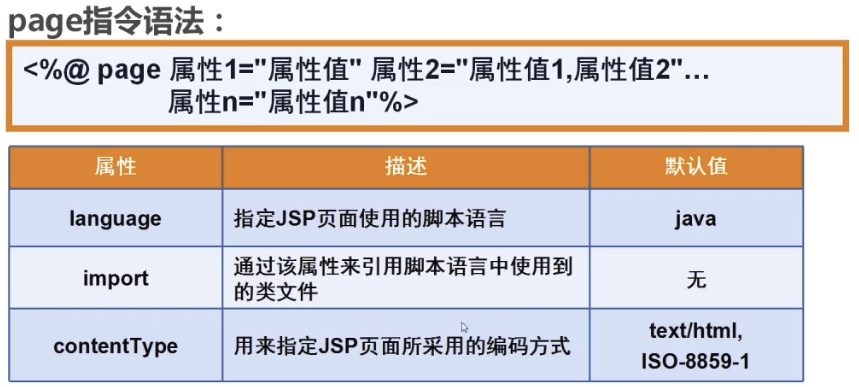
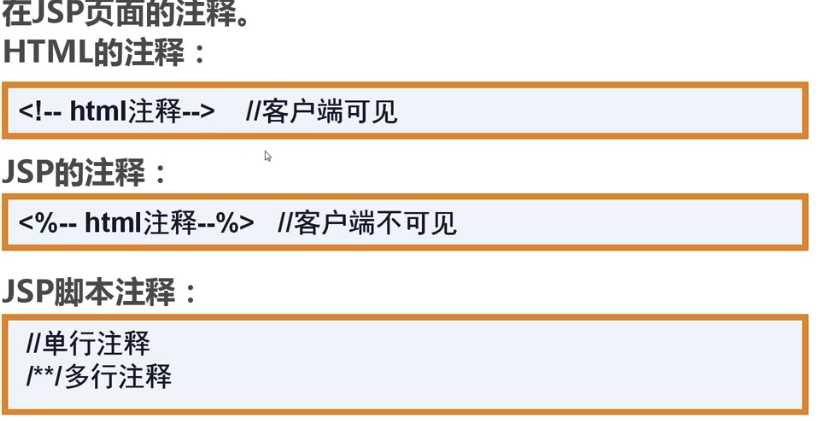
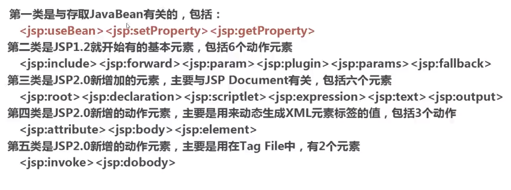
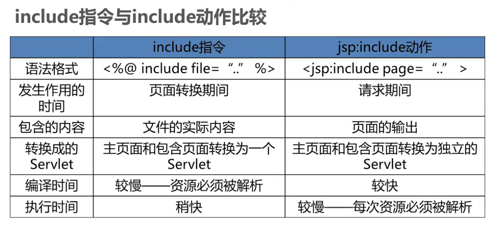
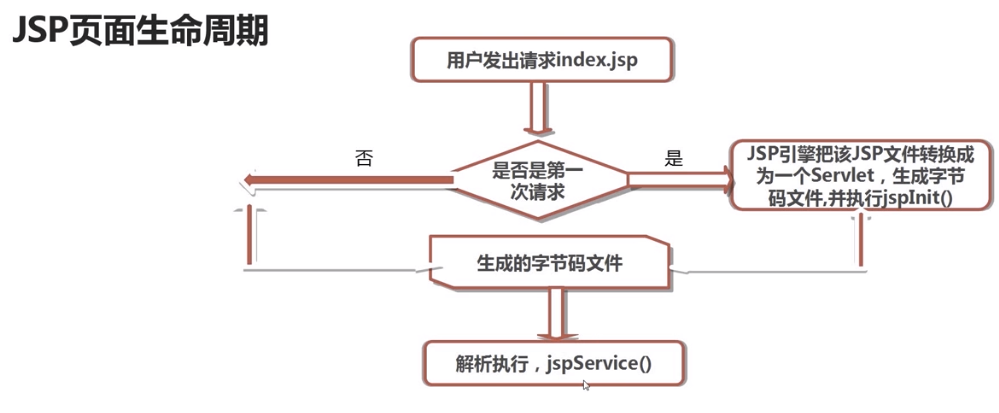
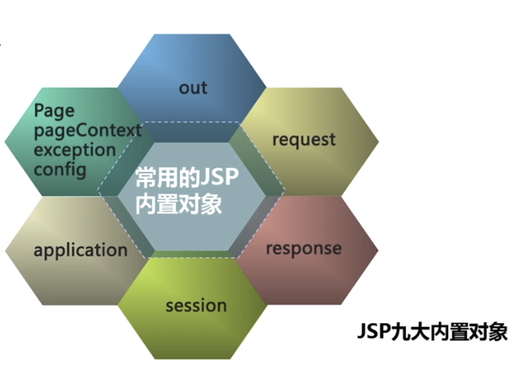
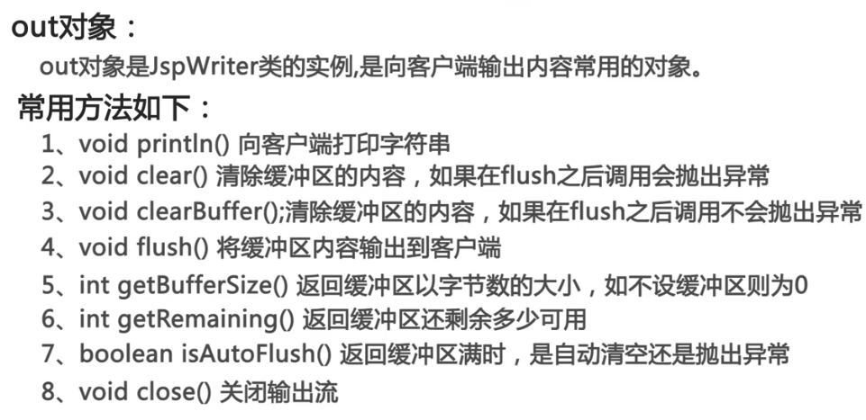
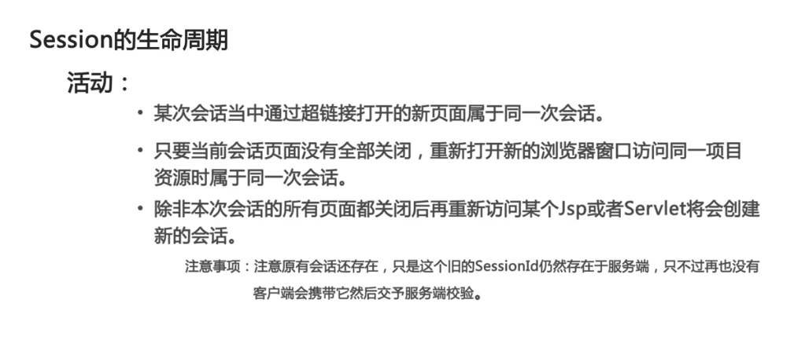

## JSP介绍
JSP全称Java Server Pages,其本质是一种简化Servlet的设计，它实现了在Java中使用HTML标签，JSP是一种动态网页技术标准，也只JavaEE的标准，JSP和Servlet一样，在服务端执行。

## 常见动态网站开发技术对比
- Jsp：Java平台，安全性高，适合开发大型的，企业级的Web应用程序
- Asp.net：.net平台，简单易学，但安全性与跨平台性差
- Php：简单，高效，成本低，开发周期短，特别适合中小型企业(LAMP:Linux+Apache+Mysql+PHP)

## Jsp页面元素构成

### 指令
- page指令：

- include指令

        <%@include file="" %>
### Jsp注释

### Jsp脚本

        <%Java代码%>
### Jsp声明

        <%! 声明变量，方法，类 %>
### Jsp表达式

        <%= 表示式(不以；结尾) %>
### Jsp动作

- include动作

        <jsp:include page="url" flush="true|false"/>
- forward动作

        <jsp:forward page="url"/>
        等同于
        request.getRequestDispatcher("url").forward(request,response);
- param动作
        
        <jsp:param name="参数名" value="参数值"/>
        常常与<jsp:forward/>一起使用，作为其子标签
### include指令和include动作的区别

## Jsp页面的生命周期

## 九大内置对象

### out对象

## session对象
- session表示浏览器与服务器的一次会话

- session的生命周期

-session的销毁

        1.调用session.invalidate()方法
        2.session过期
        3.服务器重启
- exception对象

        1.在page指令中加入isErrorPage="true"
        2.使用exception对象(getMessage,toString)

## 中文乱码问题
- post表单中文乱码：request.setCharacterEncoding("utf-8");
- url中的中文参数乱码：在server.xml中的Connector中添加URIEncoding="utf-8"

## 请求转发跟请求重定向的区别
- 请求重定向：客户端行为，response.sendRedirect(),从本质上讲等同于两次请求，前一次的请求对象不会保存，地址了的URL会变
- 请求转发：服务器行为，request.getRequestDispatcher().forward(req,resp),一次请求，转发后会保存，地址栏的URL不会变

## Javabean
- Javabean是符合某种特定规范的java类
- 优点：解决代码重复编写，减少代码冗余，功能区分明确，提高了代码的维护性
- 设计原则：类公有-属性私有-无参共有构造方法-get和set方法

## Jsp状态管理
- http协议的无状态性：服务器不会记住你
- 保存用户状态的两大机制：session和cookie

        cookie的作用：
                     对特定对象的跟踪
                     保存客户的浏览记录和习惯
                     简化登录
        安全风险：容易泄露信息
        jsp中创建cookie：
        Cookie cookie = new Cookie(key,value);
        response.addCookie(cookie);
        //读取cookie
        Cookie[] cookies = request.getCookies();
- cookie与session的区别

        cookie：可以长期保存在客户端，存的是String，保存不重要的信息
        session：在服务端保存信息，保存Object，随会话的结束而销毁，保存重要信息

