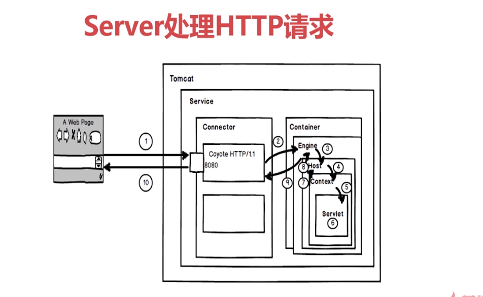

# 概述

    Tomcat是一个轻量级的Web服务器，是一个运行jsp和servlet的容器
# 架构图

# 常用配置项修改
1.修改tomcat端口

    在Connector节点中修改port：
    <Connector port="8080" protocol="HTTP/1.1" connectionTimeout="20000" redirectPort="8443" />
2.修改内存

    在start文件或catalina文件中添加以下配置项：
    set JAVA_OPTS="-server -Xms{最小的堆内存}m -Xmx{最大的堆内存}m -XX:MetaspaceSize={初始名空间大小}m -XX:MaxMetaSpaceSize={最大名空间大小}m "
