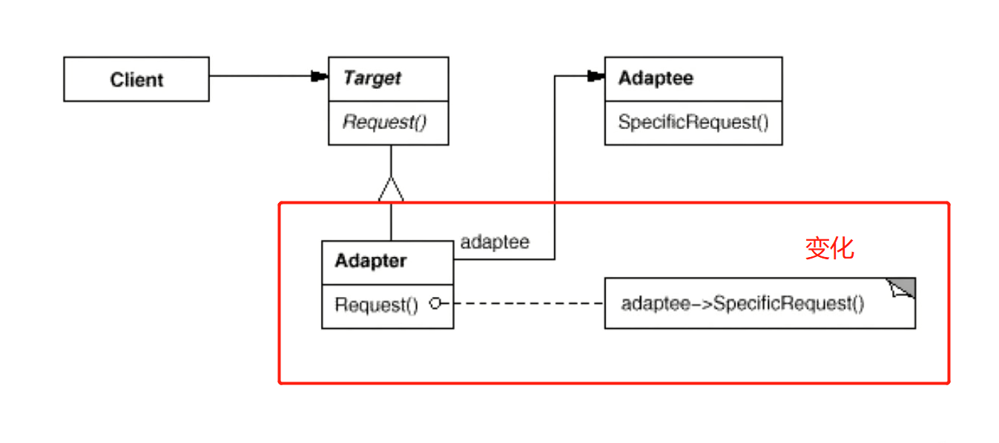

# 使用场景

    希望复用一些现存的类，但是接口与复用场景不一致。
    在遗留代码复用，类库迁移等方面非常有用

# UML图

    总的来说，假如客户端定义了一个新接口，里面的新方法的实现要用到老的接口中方法，那么就可以写一个Adapter实现新接口，在Adapter中通过调用老接口中的方法实现该方法，最终实现新接口。
    适配器模式实现的两种方式：
    1.类适配器
    Adapter继承现有的Adaptee并实现Target接口
    2.对象适配器
    Adapter继承Target类，并含有一个Adaptee的对象引用