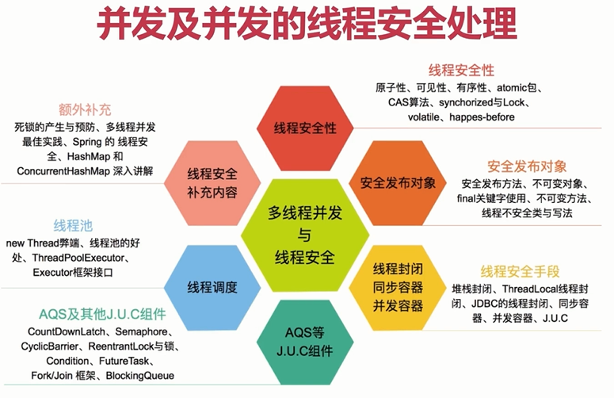
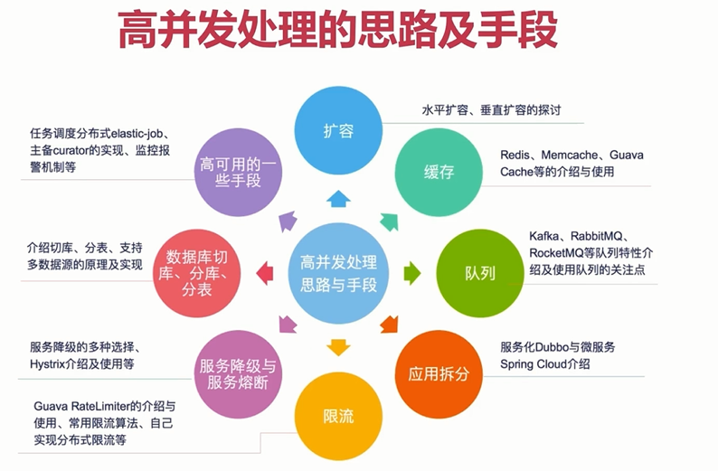

# 什么是并发

    在操作系统中，是指一个时间段中有几个程序都处于已启动运行到运行完毕之间，且这几个程序都是在同一个处理机上运行，但任一个时刻点上只有一个程序在处理机上运行

# 什么是高并发(High Concurrency)

    是互联网分布式系统架构设计中必须考虑的因素之一，它通常是指，通过设计保证系统能够同时并行处理很多请求

## 并发及并发的线程安全处理

## 高并发处理的思路及手段
