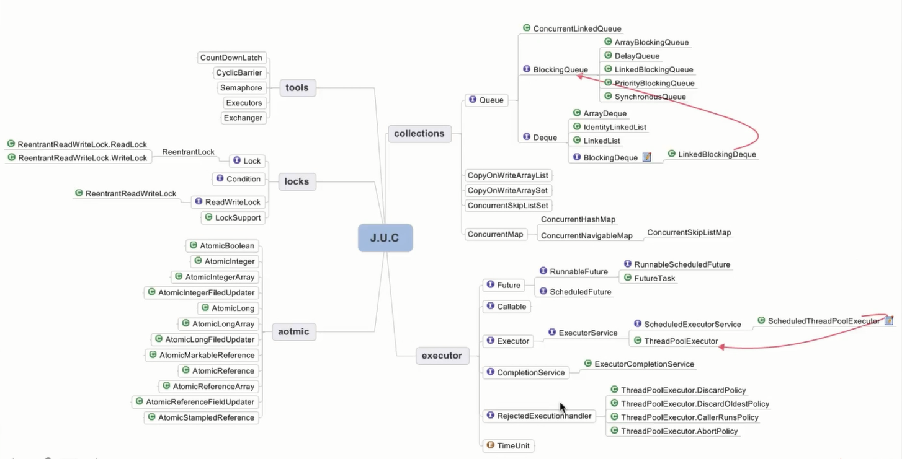

# 不可变对象
## 不可变对象需要满足的条件

    1.对象创建后其状态就不能修改
    2.对象所有域都是final类型
    3.对象是正确创建的(在对象创建期间,this引用没有逸出)

## 常用的不可变对象

    1.final修饰的对象
    2.Collections.unmodifiableXXX
    3.ImmutableXXX:com.google.common.collect

# 线程封闭

    1.Ad-hoc线程封闭：程序控制是实现,最糟糕,忽略
    2.堆栈封闭：局部变量,无并发问题
    3.ThreadLocal线程封闭：特别好的封闭方法

# 线程不安全类与写法

    线程不安全  -->   线程安全
    StringBuilder    StringBuffer
    SimpleDateFormat JodaTime
    ArrayList,HashSet,HashMap等Collections

# 同步容器

    ArrayList -> Vector,Stack
    HashMap -> HashTable(key,value不能为null)
    Collections.syschronizedXXX(List,Set,Map)

# 并发容器J.U.C

    ArrayList -> CopyOnWriteArrayList
    HashSet、TreeSet -> CopyOnWriteArraySet、ConcurrentSkipListSet
    HashMap、TreeMap -> ConconrrentHashMap、ConcurrentSkipListMap

# 总结

    1.线程限制:一个被线程限制的对象,由线程独占,并且只能被占有它的线程修改
    2.共享只读:一个共享只读的对象,在没有额外同步的情况下,可以被多个线程并发访问,但是任何线程都不能修改它
    3.线程安全对象:一个线程安全的对象或者容器,在内部通过同步机制来保证线程安全,所以其他线程无需额外的同步就可以通过公共接口随意访问它
    4.被守护对象:被守护的对象只能通过特定的锁来访问