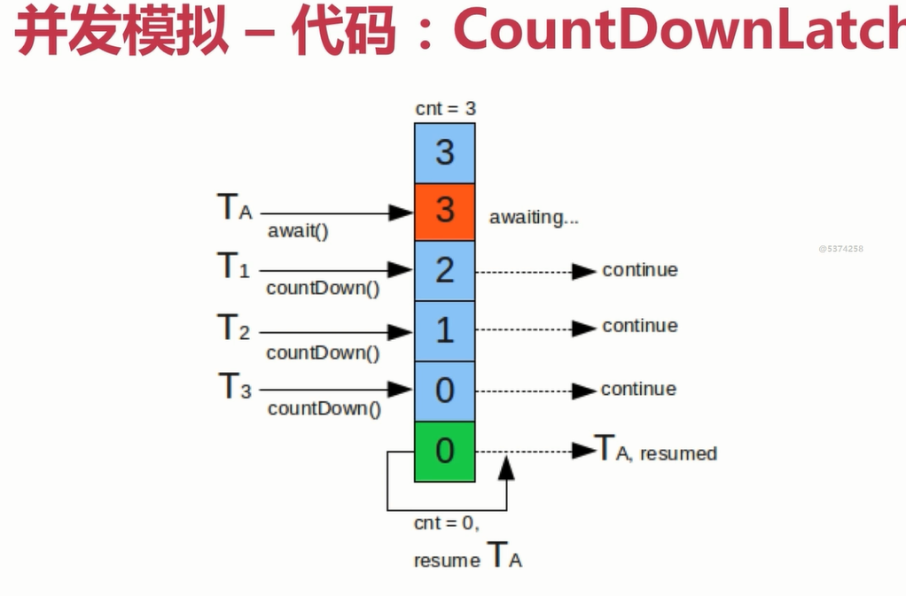

# 并发模拟工具

    Postman:Http请求模拟工具
    Apache Bench(AB):Apache附带的工具,测试网站性能
        ab -n 1000 -c 50 http://localhost:8080/test
    JMeter:Apache组织开发的压力测试工具
    代码:Semaphore、CountDownLatch等

# 代码:CountDownLatch
