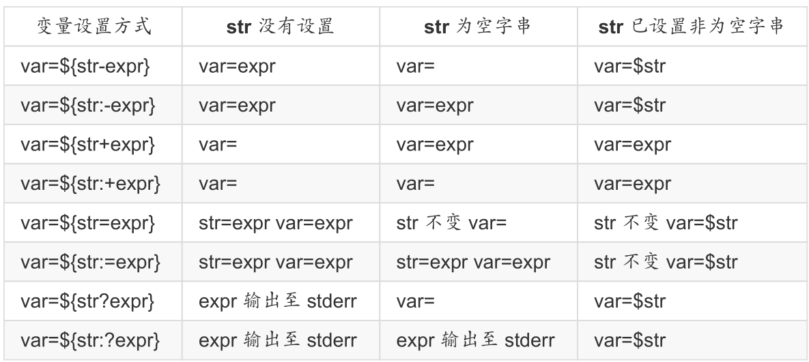

# bash变量类型
	1.环境变量:作用域为当前shell进程及其子进程
	export varname = value
	2.本地变量(局部变量):作用域为整个bash进程
	local varname = value
	3.位置变量:
	$`,$2, ...
	shift:剔除参数
	4.特殊变量
	$?:上一个命令得执行状态返回值
	$#:变量个数
	$*:参数列表
	$@:参数列表

# 查看当前shell中的环境变量
	printenv
	env
	export

# 条件测试的表达式
	[ expression ]
	[[ expression ]]
	test expression
	整数测试:
		-eq:等于
		-ne:不等于
		-gt:大于
		-lt:小于
		-ge:大于等于
		-le:小于等于
	文件测试:
	-e FILE:测试文件是否存在
	-f FILE:测试文件是否为普通文件
	-d FILE:测试指定路径是否为目录

# 变量赋值
