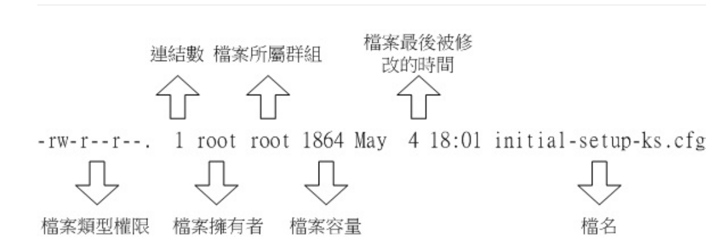

# 文件基本信息

# 修改系统默认语系

    修改/etc/locale.conf文件

# 改变文件属性与权限的命令

    chgrp:改变文件所属群组
    chown:改变文件拥有者
    chmod:改变文件的权限,SUID,SGID,SBIT等特性

# 操作文件的常用命令

    basename
    dirname
    cat  -n:行号 -b:去空白行行号 -A:区分空白
    tac
    nl 
    less more
    head tail
    od:二进制读取文件

# 压缩与解压缩
    1.gzip、bzip2、xz
        压缩:gzip -v 压缩文件(原有文件会被删除,压缩的后缀为gz)
        解压:gzip -d 压缩文件(原有文件会被删除)
        bizp、xz用法与gzip一致,压缩文件的后缀分别为bz2、xz
        压缩率gzip < bzip2 < xz