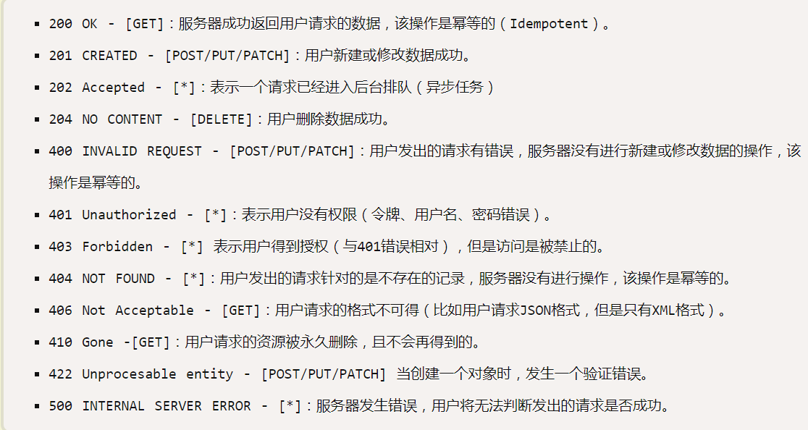
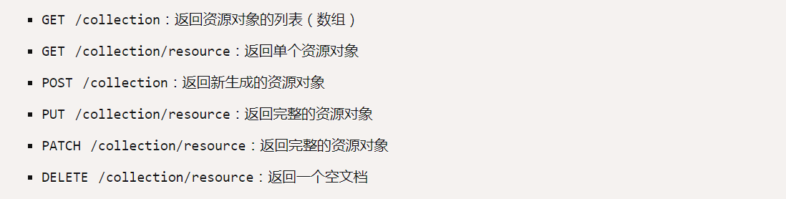

# 什么是RESTful(Representational State Transfer 表现层状态转换)

    RESTful是一种互联网软件架构.具有以下特征
        1.每一个URI代表一种资源
        2.客户端与服务器之间，传递这种资源的某种表现层
        3.客户端通过HTTP提供的四种操作实现表现层状态转换
## 资源

    网络上的一个实体,可以用URI指向它
## 表现层

    资源呈现出来的形式,例如文件的格式,http请求头中用Accept和Content-Type字段指定
## 状态转换

    客户端操作服务器,通过某种手段,让服务器端发生"状态转换",例如GET,POST,PUT,DELETE.

## 设计误区

    1.URI包含动词
    2.URI包含版本号

# RESTful设计指南
## 协议
    API与用户的通信协议是HTTPs
## 域名
    尽量部署在专用域名之下
## 版本
    将API的版本号放入URL
## 路径
    每个网址代表一种资源，名词常与数据库表对应
## HTTP名词
    资源的具体操作类型由HTTP动词表示
## 过滤信息
    API应该提供参数，过滤返回结果
## 状态码
    服务器向用户返回的状态码和提示信息，常用如下

## 错误处理
    如果状态码是4xx，就应该向用户返回错误信息
## 返回结果
    返回的结果规范

    