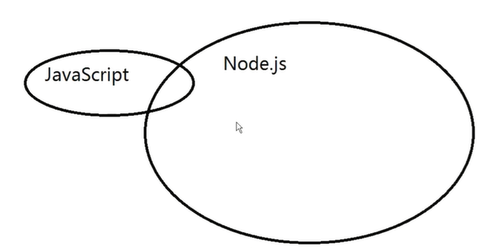
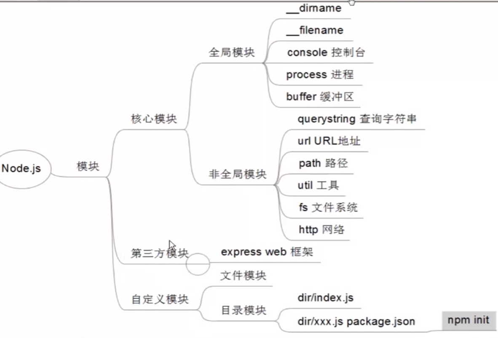

## Node.js 介绍

### 为什么要学习 Node.js

- 企业需求
    + 具有服务端开发经验更好
    + front-end
    + back-end
    + 全栈开发工程师
    + 基本的网站开发能力
        *服务端
        *前端
        *运维部署

### Node.js是什么
is JavaScript runtime built on Chrome's V8 JavaScript engine.
* nodejs可以解析和执行js代码
- 浏览器中的JavaScript
    + EcmaScript
        * 基本语法
        * if
        * var
        * function
        * Object
        * Array
    + BOM
    + DOM
- nodejs中的JavaScript
    + 没有BOM和DOM
- 模块化编程
    + RequireJS
    + SeaJS

### node.js有哪些特点
1. 事件驱动(当事件被触发时，执行传递过去的回调函数)    
2. 非阻塞I/O模型(当执行IO操作，不会阻塞线程)
3. 单线程
4. 拥有世界最大的开源库 --npm

### node.js与javascript的关系

    javascript有BOM和DOM，nodejs有大量的第三方库
    javascript运行在前端，nodejs运行在后端

### 全局对象
#### 全局变量
    __dirname
    __filename

#### 全局对象

    console
        .log .info .error 
    process
        .arch  .pid .kill .platform .env .execPath .versions
    buffer
        .from .alloc 

## package 和 NPM

    安装淘宝镜像:npm install -g cnpm
     淘宝镜像：--registry=https://registry.npm.taobao.org

## Node.js核心模块
    每个js文件都是一个模块
    分类：核心模块、第三方模块、自定义模块

### 工具模块
    1.querystring：parse把查询字符串解析为JavaScript对象；stringify把JavaScript对象还原为查询字符串
    2.url：parse解析url地址；format将url的解析内容还原为url
    3.path：join拼合路径；isAbsolute判断路径是否是绝对路径；extname获取一个文件的扩展名
    4.util:isArray判断是否是数组；isDate是否是日期；isRegExp是否是正则

### 核心模块：fs

    1.readFileSync：读成buffer，同步
    2.readFile:读成buffer，异步
    3.writeFileSync
    4.writeFile
    5.appendFile
### 核心模块：http

    1.服务器端：接受请求，处理请求，返回响应
    2.客户端：模拟客户端发出请求

### mysql模块
    
    const mysql = require('mysql')
    let connection = mysql.createConnection({
        user:'root',
        password:'x'
    });
    connection.connection((err)=>{
        if(err){
            throw err;
        }
    });
    connection.release();
    推荐以下方式，不需要手动释放连接：
    let pool = mysql.createPool({

    });
    pool.query(sql,[占位参数],(err,result)=>{

    });

### bcryptjs实现加密

    1.let salt = bcrypt.genSaltSync(10);
    2.let encryptePwd = bcrypte.hashSync(明文密码,salt);
    3.bcrypte.compareSync(encrytePwd,数据库密码);

