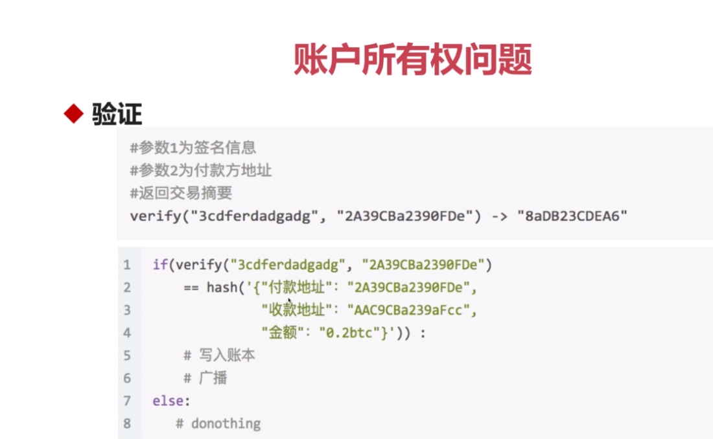

# 区块链前世今生
## 密码朋克(Cypherpunk)

# 区块链前景
## 应用场景

    资产：数字资产发行、支付、交易、结算
    记账：股权交易、供应链金融、商业积分
    不可篡改：众筹、医疗证明、存在性证明
    点对点：共享经济、物联网
    隐私：匿名交易

## 区块的组成
    区块头：序号、时间戳、Hash值
    区块体：交易记录
# 什么是比特币

    比特币是数字货币，货币是可以承载价值的一般等价物。

## 比特币的特点：

    1.财产只受自己控制
    2.无通胀
    3.没有假钞
    4.流通性好
    5.去中心化记账系统

## 比特币原理

### 账本如何验证

### 所有权问题

    摘要与私钥签名得到签名号
    签名号与地址验证得到摘要

### 为什么记账

### 以谁的账本为准：区块链技术
