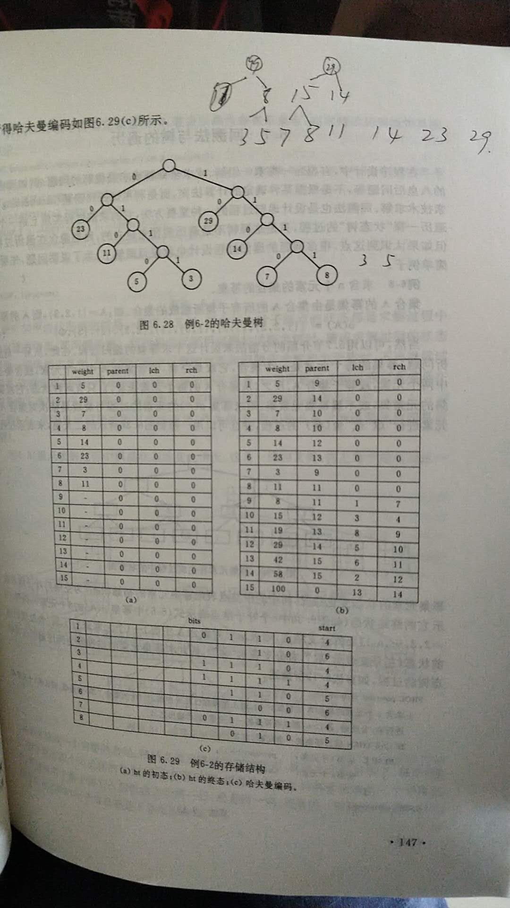

# 概述

    树型结构是一类重要的非线性数据结构

# 基本术语

    节点：包含一个数据元素和若干指向其子树的分支
    节点的度：节点子树的数目
    叶子节点：度为零的节点
    树的度：取各节点度的最大值
    深度：树的最大层次

# 二叉树

    每个节点最多有两棵子树，子树有左右之分，其次序不能任意颠倒
    
    二叉树的性质：
    1.深度为K的二叉树的最大节点数为 2^K-1 个节点
    2.二叉树在第i层最多有 2^(i-1)个节点
    3.设叶子节点为n0，度为2的节点为n2，n0=n2+1
    4.具有n个节点的完全二叉树的深度为log2(n)+1

# 哈夫曼树

    哈夫曼树又称最优树，是一类带权路径长度最短的树，用于哈夫曼编码

